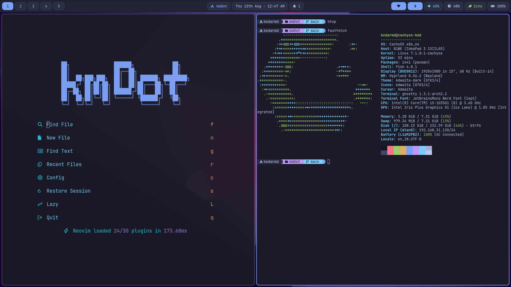
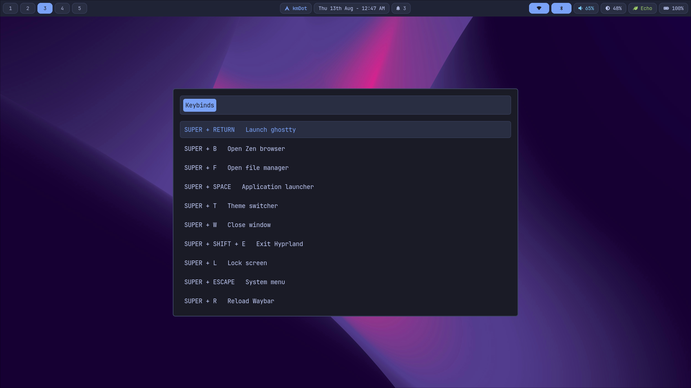
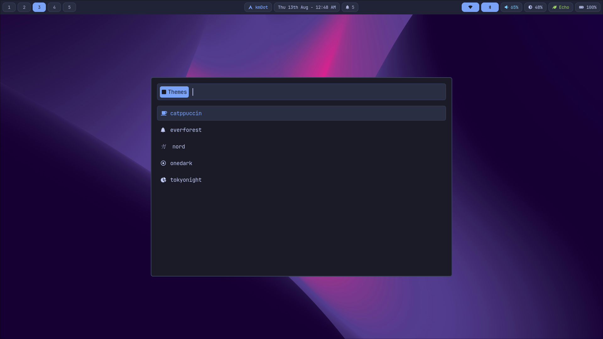

# kmDot

Dotfiles for CachyOS + Hyprland. Source of truth is this repo; sync copies config to `~/.config/kmdot` and symlinks to standard locations.

## Apps

fish · ghostty · hyprland · nvim · rofi · starship · swaync · waybar · tmux · xdg-desktop-portal · theme-switcher · battery

## Screenshots






## Install

```bash
sudo pacman -S gum
./install.sh   # multi-select TUI
```

Single-app re-sync: `./sync/<app>.sh` (skips TUI).

## Theme Switching

```bash
theme-switcher/main.sh <theme>
```

Or via the quickshell theme launcher (Super+T, after sync):

```bash
~/.config/kmdot/quickshell/scripts/toggle.sh kmdot-theme
```

Themes: catppuccin, everforest, nord, onedark, tokyonight

## Tmux

- Prefix: `C-s`
- Config: `config/tmux/conf.d/` (modular: 00-base, 10-bindings, 20-theme, 90-plugins)
- Reload: `C-s r`
- TPM: `git clone https://github.com/tmux-plugins/tpm ~/.tmux/plugins/tpm`
- UTF-8 locale required for Nerd Fonts (`LANG=en_IN.UTF-8`)

## Troubleshooting

- **hyprpaper errors on theme switch**: start hyprpaper before switching — the wallpaper script (`config/hyprland/scripts/cycle_wallpapers.sh`) exits early if hyprpaper isn't running.
- **Tmux Nerd Font glyphs missing**: set `LANG=en_IN.UTF-8 LC_ALL=en_IN.UTF-8`.
